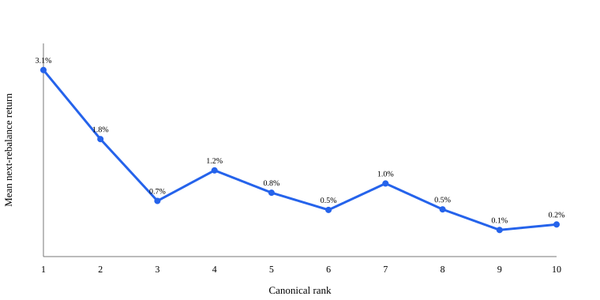

# Dual Momentum Rank-Depth / Edge-Decay Audit

Canonical DM and MRM were reconstructed unchanged. No alternative top-N portfolio was built or tested.

## Final classification

**Weak/descriptive edge concentration; Top-5 boundary unsupported; Non-monotonic ranking signal.**

Do not run a top-N portfolio experiment from this evidence. Keep canonical top-N=5 unchanged.

## Ranking and rebalance reconciliation

| Strategy | Complete periods | Selected-set matches | Missing outcome prices |
|---|---:|---:|---:|
| DM | 60 | 60 | 0 |
| MRM | 60 | 60 | 0 |

Scores use closes strictly before each rebalance; returns use exact rebalance-open to next-rebalance-open prices.

## DM exact rank 1–10 forward performance

| Rank | N | Mean | Median | Win rate | Beat SPY | Beat universe median | Top quartile | P10 | P90 |
|---:|---:|---:|---:|---:|---:|---:|---:|---:|---:|
| 1 | 60 | 3.13% | 1.19% | 56.7% | 51.7% | 48.3% | 33.3% | -7.55% | 14.04% |
| 2 | 60 | 1.82% | 0.36% | 55.0% | 46.7% | 48.3% | 25.0% | -7.79% | 12.64% |
| 3 | 60 | 0.66% | -0.15% | 48.3% | 50.0% | 46.7% | 23.3% | -6.50% | 8.27% |
| 4 | 60 | 1.24% | 1.13% | 53.3% | 50.0% | 53.3% | 21.7% | -6.76% | 10.42% |
| 5 | 60 | 0.82% | 0.74% | 56.7% | 53.3% | 50.0% | 35.0% | -7.13% | 10.14% |
| 6 | 60 | 0.49% | 0.19% | 50.0% | 41.7% | 48.3% | 21.7% | -7.25% | 8.59% |
| 7 | 60 | 0.99% | 1.20% | 60.0% | 58.3% | 51.7% | 33.3% | -7.21% | 9.29% |
| 8 | 60 | 0.50% | 0.76% | 61.7% | 50.0% | 50.0% | 30.0% | -9.01% | 9.80% |
| 9 | 60 | 0.11% | 0.20% | 51.7% | 48.3% | 45.0% | 30.0% | -8.58% | 10.44% |
| 10 | 60 | 0.22% | -0.01% | 50.0% | 43.3% | 45.0% | 28.3% | -9.25% | 8.73% |

Spearman(rank, return) = -0.032, rebalance-cluster 95% CI [-0.099, 0.041], effective N=60. The mean curve decreases on 6 of 9 adjacent steps.

## Preregistered comparisons

| Comparison | Mean difference | Median difference | Win-rate difference | P10 difference | Cluster 95% CI | Effect size |
|---|---:|---:|---:|---:|---:|---:|
| Top 3 vs ranks 4–5 | 0.84% | -0.53% | -1.7% | -0.48% | [-1.16%, 3.23%] | 0.09 |
| Ranks 1–2 vs ranks 3–5 | 1.57% | 0.45% | 3.1% | -0.64% | [-1.00%, 4.76%] | 0.14 |
| Top 5 vs ranks 6–10 | 1.07% | -0.28% | -0.7% | 1.05% | [-0.22%, 2.40%] | 0.20 |

## Cumulative depth / edge decay

| Depth | Mean return | Added-rank mean | Added rank vs higher ranks |
|---:|---:|---:|---:|
| 1 | 3.13% | 3.13% | — |
| 2 | 2.47% | 1.82% | -1.30% |
| 3 | 1.87% | 0.66% | -1.81% |
| 4 | 1.71% | 1.24% | -0.63% |
| 5 | 1.53% | 0.82% | -0.90% |
| 6 | 1.36% | 0.49% | -1.04% |
| 10 | 1.00% | 0.22% | -0.87% |

## Accuracy, magnitude, and tails

| Group | Win | Beat SPY | Beat universe | Top quartile | Avg winner | Avg loser | Expectancy |
|---|---:|---:|---:|---:|---:|---:|---:|
| Ranks 1–2 | 55.8% | 49.2% | 48.3% | 29.2% | 9.08% | -5.88% | 2.47% |
| Ranks 1–3 | 53.3% | 49.4% | 47.8% | 27.2% | 8.16% | -5.32% | 1.87% |
| Ranks 4–5 | 55.0% | 51.7% | 51.7% | 28.3% | 6.04% | -5.10% | 1.03% |
| Ranks 6–10 | 54.7% | 48.3% | 48.0% | 28.7% | 5.83% | -6.01% | 0.46% |

Removing each group's top 1% outcomes leaves a top-3 minus ranks-4–5 difference of 0.50%. Top-3's top 1% / top 5 / top 10 observations contribute 16.8% / 25.9% / 38.8% of its positive-return sum.

## Score spacing

| Boundary | Mean score gap | Gap/return-difference rho | Small-gap return diff | Large-gap return diff |
|---|---:|---:|---:|---:|
| 1-2 | 0.2601 | 0.056 | -0.35% | 2.96% |
| 2-3 | 0.0881 | 0.036 | 0.44% | 1.89% |
| 3-4 | 0.0516 | -0.117 | -0.03% | -1.12% |
| 4-5 | 0.0419 | -0.016 | 1.19% | -0.35% |
| 5-6 | 0.0317 | -0.157 | 3.00% | -2.35% |

## Chronological and concentration stability

Top-3 minus ranks-4–5 is -0.09% in the first half and 1.78% in the second. Leave-one-year-out estimates: 2021: 1.37%, 2022: 0.65%, 2023: 0.88%, 2024: 1.25%, 2025: 1.00%, 2026: -0.06%.
Largest leave-one-security influence: INTC (remaining difference 0.27%). Full security/group attribution is in results.json.

## Drawdown behavior

| Episode | Periods | Top 3 | Ranks 4–5 | Ranks 6–10 |
|---|---:|---:|---:|---:|
| 2021-12-29 to 2022-06-17 | 7 | -0.59% | -0.92% | -1.01% |
| 2022-11-30 to 2023-05-31 | 7 | -1.48% | -1.79% | -0.74% |
| 2025-02-19 to 2025-04-08 | 3 | -2.75% | -1.20% | -1.52% |

## Clustered inference and rank-label null

Within-rebalance shuffled-rank empirical directional p-values are H1=0.203, H2=0.053, and H3=0.187. These are lightweight diagnostic calibrations, not proof of a deployable variant.

## Diversification implication

The descriptive top-3 period-return volatility is 29.0% annualized (sqrt-12), with average correlation 0.31 across rank slots and a worst single-name period of -34.5%. This is not a top-3 portfolio backtest.

## Compact MRM comparison

| Strategy | Rank rho | Top3 minus 4–5 | Top5 minus 6–10 |
|---|---:|---:|---:|
| DM | -0.032 | 0.84% | 1.07% |
| MRM | -0.012 | -0.57% | 0.18% |

## Artifacts

`results.json` is the machine-readable result; `dm_rank_ledger.csv` and `mrm_rank_ledger.csv` contain every ranked eligible security and forward outcome. Canonical DM, MRM, frozen forward tests, and Alpaca automation were not modified.
